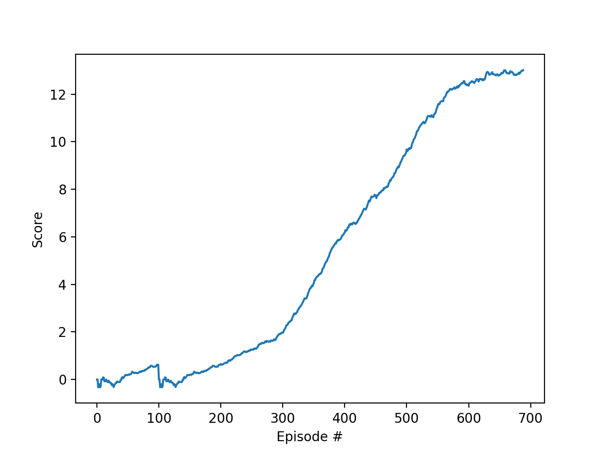

# Udacity Deep Reinforcement Learning Nano Degree
## Navigation Project Report

### Learning Algorithm

<!-- The report clearly describes the learning algorithm, along with the chosen hyperparameters. It also describes the model architectures for any neural networks. -->
We used Double DQN to solve the Banana Unity environment with a pair of neural network containing two fully connected hidden layers according to the following update rule:
```python
# We randomly select whether we evaluate qnetwork_target actions with qnetwork_local
if np.random.rand() >= 0.5:
    # So we pick our next actions according to qnetwork_target
    next_actions = self.qnetwork_target(next_states).detach().max(1)[1].unsqueeze(1)
    # Now evaluate those choices with qnetwork_local
    q_next_state = self.qnetwork_local(next_states).gather(1,next_actions)

# Or if we evaluate qnetwork_local action with qnetwork_target
else:
    # Pick the actions with qnetwork_local
    next_actions = self.qnetwork_local(next_states).detach().max(1)[1].unsqueeze(1)
    # Evaluate the state-action pairs with qnetwork_target
    q_next_state = self.qnetwork_target(next_states).gather(1, next_actions)

# Calculate the value of Q(s',a')
q_target = rewards + gamma * q_next_state * (1 - dones)

# Calculate the value of Q(s,a)
q_current = self.qnetwork_local(states).gather(1, actions)

# The expected value is just an average because we use replay buffer to
# ensure the samples are i.i.d.
loss = F.mse_loss(q_current, q_target)

# Update qnetwork_local.parameters()
self.optimizer.zero_grad()
loss.backward()
self.optimizer.step()
```
 ReLu activation functions were used in all layers except the final layer since we are trying to approximate a continuous-valued function and don't wish to inappropriately truncate our output's range to only non-negative values.

### Plot of Rewards

<!-- A plot of rewards per episode is included to illustrate that the agent is able to receive an average reward (over 100 episodes) of at least +13. The submission reports the number of episodes needed to solve the environment. -->


A plot of the episodic score against the episode number is shown above. We were fortunate that our neural network was able to monotonically improve for the majority of training instances and solved the task inside of 700 episodes.

### Ideas for Future Work

<!-- The submission has concrete future ideas for improving the agent's performance. -->
To further improve the performance of our agent we could update the model to use a pair of Dueling DQNs for the Double DQN updates and implement a Prioritized Experience Replay buffer to update the network on samples with more significant TD-error.

### References
1. [Double Deep Q Networks](https://towardsdatascience.com/double-deep-q-networks-905dd8325412)
2. [PyTorch Tutorials](https://pytorch.org/tutorials/)
3. [IPython Reference](https://ipython.readthedocs.io/en/stable/interactive/reference.html#command-line-usage)
